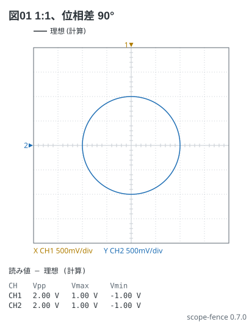
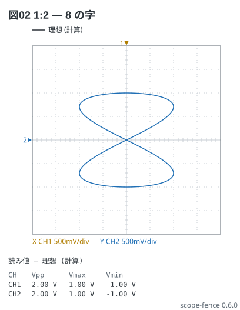

# リサージュ (XY)

Analog Discovery 2-5。W1 を CH1 (横)、W2 を CH2 (縦) につなぎ、`view: xy` で描く。
周波数の比と位相差が曲線の形で読める。

同じ周波数で位相が 90° ずれると円 (振幅が同じとき)。

```scope
title: 図01 1:1、位相差 90°
view: xy
ch1: sine 1kHz 1V
ch2: sine 1kHz 1V phase 90deg
xy: ch1 ch2
```



横 2 kHz・縦 1 kHz の 1:2 は 8 の字。**横切る縦の中心線の数 (4) と、横の中心線の数 (2) の比が
周波数の比** (横 : 縦 = 4 : 2 = 2 : 1)。

```scope
title: 図02 1:2 — 8 の字
view: xy
ch1: sine 2kHz 1V
ch2: sine 1kHz 1V
xy: ch1 ch2
```


