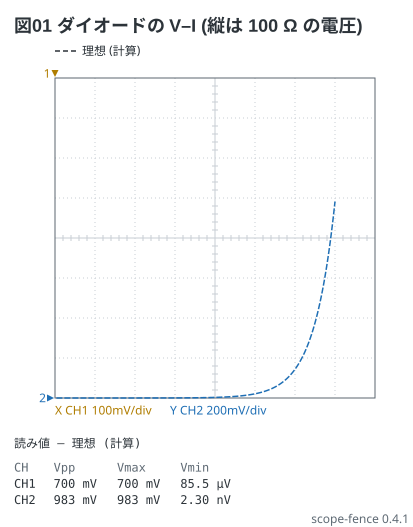

# ダイオードの特性 (式と XY)

Analog Discovery 2-13 / 電験 6-1。ダイオードの電圧を CH1 (横)、100 Ω の電流検出抵抗の電圧を
CH2 (縦) に取ると、XY に V–I の曲線が出る。理想の曲線はダイオードの式
I = Is (e^(V / nVT) − 1) を **ch の行の式** (`= …`) で書く — 100 Ω × Is = 1.4 µV、n VT = 52 mV。

縦の 1 V は電流 10 mA (100 Ω)。0 V を左下の角に置く (`position: -4div` — 8 目盛の画面の端)。

```scope
title: 図01 ダイオードの V–I (縦は 100 Ω の電圧)
view: xy
ch1: {wave: triangle 50Hz 0.35V offset 0.35V, range: 100mV/div, position: -4div}
ch2: {wave: = 1.4uV * (exp(ch1 / 52mV) - 1), range: 200mV/div, position: -4div}
xy: ch1 ch2
```



読み値の CH1 の Vmax (700 mV) が掛けた順電圧、CH2 の Vmax (983 mV → 9.8 mA) がそのときの電流。
0.5 V までは電流がほとんど流れず、0.6 V を越えると急に立ち上がる。
