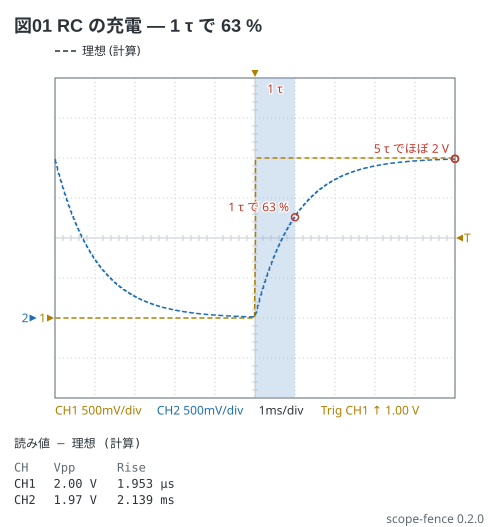
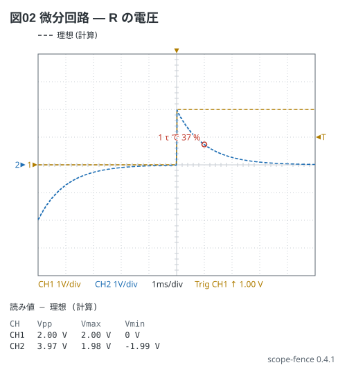
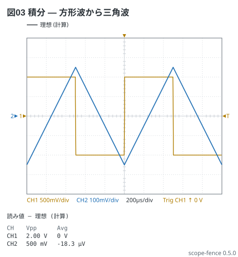
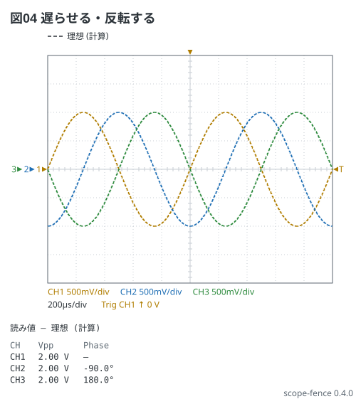

# 注釈と微分・積分 (notes:・hp・integrate)

電験 5-1 の RC の充電に**注釈**を置く。0〜2 V・100 Hz の方形波を τ = 1 ms の RC に入れると、
C の電圧は立ち上がりから 1 τ (1 ms) で 2 V の 63 % (1.26 V) に届く。その点に字を、
0〜1 ms に帯を置く。番地は **時刻 電圧**、電圧は ch1 の V/div で読むので、CH2 の線の上の点には
`ch2` と書く。

```scope
title: 図01 RC の充電 — 1 τ で 63 %
time: 1ms/div
trigger: ch1 rising 1V
ch1: {wave: square 100Hz 1V offset 1V, range: 500mV/div, position: -2div}
ch2: {wave: ch1 | rc 1ms, range: 500mV/div, position: -2div}
notes:
  - band 0 1ms: 1 τ
  - text ch2 1ms 1.26V: 1 τ で 63 %
  - mark ch2 5ms 1.99V
  - text ch2 5ms 1.99V: 5 τ でほぼ 2 V
measure: [vpp, rise]
```



1 τ の値をカーソルで読むのは [00-rc-charging.md](00-rc-charging.md) の図03 (ΔX の CH2 が 1.26 V)。
Rise (10〜90 %) は 2.14 ms — 2.2 τ に近い
(半周期 5 τ では 2 V まで届ききらないので、少し短く出る)。

同じ方形波の **R の電圧** (CR の微分回路) は `hp 1ms`。跳びのたびに ±2 V 近い山が立ち
(Vmax 1.98 V・Vmin −1.99 V)、τ で落ちる — 1 τ 後に 37 % (736 mV)。
`rc` と `hp` の和はいつも入力 (V_R + V_C = V_in)。

```scope
title: 図02 微分回路 — R の電圧
time: 1ms/div
trigger: ch1 rising 1V
ch1: {wave: square 100Hz 1V offset 1V, range: 1V/div, position: 0div}
ch2: {wave: ch1 | hp 1ms, range: 1V/div, position: 0div}
notes:
  - text ch2 1ms 736mV: 1 τ で 37 %
measure: [vpp, vmax, vmin]
```



**積分回路** (τ が周期より十分長い RC) の出力は入力の積分に比例する。`integrate 1ms` は
(1/τ)∫v dt — τ で割るので単位は V のまま。±1 V・1 kHz の方形波なら三角波の Vpp は
V·T/(2τ) = 1 V × 1 ms / 2 ms = 0.5 V。直流分の無い入力なので三角波は 0 V を中心に振れる。

```scope
title: 図03 積分 — 方形波から三角波
time: 200us/div
trigger: ch1 rising 0V
ch1: square 1kHz 1V
ch2: ch1 | integrate 1ms
measure: [vpp, avg]
```



CH2 の Vpp は 500 mV、Avg はほぼ 0 V (−18 µV)。

`delay` は時間をずらし、`invert` は符号を反転する。1 kHz の正弦に `delay 250us` (1/4 周期) で
phase −90°、`invert` で 180°。

```scope
title: 図04 遅らせる・反転する
time: 200us/div
trigger: ch1 rising 0V
ch1: sine 1kHz 1V
ch2: ch1 | delay 250us
ch3: ch1 | invert
measure: [vpp, phase]
```


