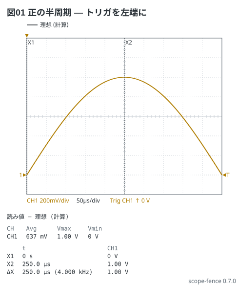
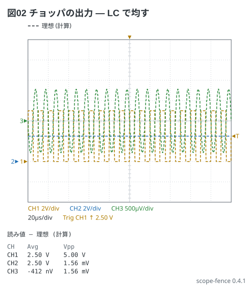

# トリガの位置と 2 次の低域 (trigger: … at・lc)

## 正の半周期を 1 画面に (電験 3-1)

1 kHz の正弦の正の半周期 (0〜500 µs) だけを見たい。50 µs/div の画面は 500 µs なので
ちょうど入るが、t = 0 (トリガの点) が真ん中のままだと −250〜250 µs が映る。
`at -5div` で t = 0 を**格子の左端**に動かす (WaveForms の Trigger Position を
画面の幅の半分ずらすのと同じ)。

```scope
title: 図01 正の半周期 — トリガを左端に
time: 50us/div
trigger: ch1 rising 0V at -5div
ch1: {wave: sine 1kHz 1V, range: 200mV/div, position: -3div}
cursors: [0, 250us]
measure: [avg, vmax, vmin]
```



Avg は 637 mV — 正の半周期の平均 2/π × 1 V。上の縁の ▼ (t = 0) とカーソル X1 (`0`) は
左端に来る。カーソルの時刻はいつもトリガの点から数える (X2 の 250 µs が山の 1.00 V)。
`data:` の実測も同じだけずれる (CSV の t = 0 がトリガの点)。

## チョッパの出力のリップル (電験 10-3)

0/5 V・100 kHz・D = 50 % の方形波を L = 100 µH・C = 100 µF の LC に通し、10 Ω の負荷を繋ぐ。
`lc f0 Q` の f0 = 1/(2π√(LC)) = 1.59 kHz、Q = R·√(C/L) = 10。

```scope
title: 図02 チョッパの出力 — LC で均す
time: 20us/div
trigger: ch1 rising 2.5V
ch1: {wave: square 100kHz 2.5V offset 2.5V, range: 2V/div, position: -2div}
ch2: {wave: ch1 | lc 1.59kHz 10, range: 2V/div, position: -2div}
ch3: {wave: ch2 | offset -2.5V, range: 500uV/div, position: 0div}
measure: [avg, vpp]
```



CH2 の平均は D × 5 V = 2.50 V。脈動は 5 V の目盛では見えないので、CH3 で 2.5 V を引いて
500 µV/div で見る (実機なら AC 結合)。Vpp 1.56 mV は小リップルの近似
ΔV = D(1−D)·V / (8·L·C·f²) = 0.25 × 5 / (8 × 100 µH × 100 µF × (100 kHz)²) = 1.56 mV と合う。
L の電流が三角に振れ、C の電圧はその積分で放物線をつなげた形になる。

`lc` は定常に入るまで 10 × Q/(π f0) (ここでは 20 ms) 助走する。助走は画面の点 128 枚ぶんまでなので、
time/div を速くしすぎると (5 µs/div) 回しきれずにお知らせが出る。
