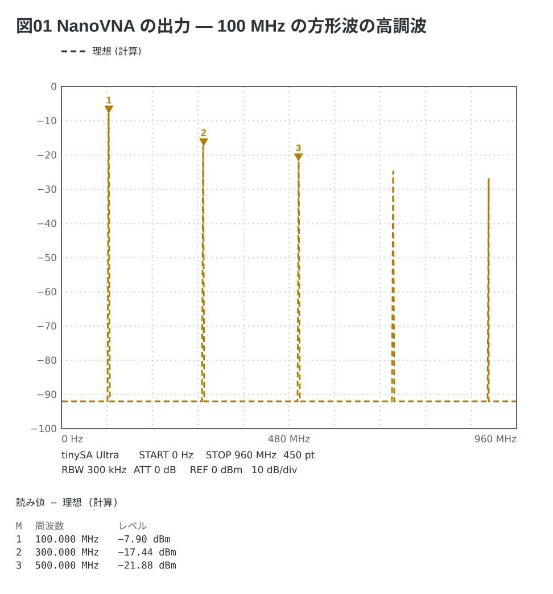

# Spectrum Fence

[English](README.md) | [日本語](README.ja.md)

Markdown の ` ```spectrum ` フェンス (YAML) を **スペクトラムアナライザの画面** —
FFT 型 (Analog Discovery の Spectrum) か掃引型 (tinySA) — として描くライブラリと CLI。
VS Code では拡張 `tommie-fence` の中で動く。



## 何のためか

スペアナで測る実験のノートには、**測る前に「こう見えるはず」の画面**が要る。
信号を波形発生器の設定と同じ語 (`square 100MHz -10dBm`) で、計器をメニューの語
(`rbw: 300kHz`、`atten: 20dB`) で書けば、フェンスが線・受信機のノイズフロア・
マーカーの読み値を計算する。測った CSV を指せば実測が重なる。

```yaml
title: 図1 NanoVNA の出力の高調波
device: tinysa-ultra          # 必須。計器の型で計算の仕方が変わる
sweep: 0-960M 450
rbw: 300kHz
ref: 0dBm
signal: square 100MHz -10dBm
markers: [100M, 300M, 500M]
```

- **`device:` は必須** — `ad2` `ad3` (FFT 型: 標本化 → 窓 → FFT、dBV) と `tinysa` `tinysa-ultra`
  `generic` (掃引型: 線を RBW の山でなぞり、DANL・ATT・LNA からフロアを足す、dBm)。
  **同じ波は 2 つの型で同じ dBm になる**。片方の型にしか無いキーはもう片方で断る
- **信号**は scope と同じ波の綴り (`sine` `square` `triangle` `sawtooth` `pulse` `dc`、振幅は peak。
  `-10dBm` は 50 Ω の正弦の電力)。並べれば和。操作 (`| rc`) は書けない
- **計器の設定はメニューの語** — `rbw:` `atten:` `lna:` `points:` (掃引型)、`samples:` `window:`
  (FFT 型)、`ref:` `scale:` `unit:` `floor:`。メニューに無い RBW は読めない
- **測った値** (`data:`) は 2 列の CSV (tinySA の SAVE TRACES、WaveForms の Spectrum の Export)。
  **Markdown と同じ場所のファイルだけ**。core はファイルを開かず、宿主が読む
- **マーカー** (周波数か `peak`) の読み値は図の下に実機の書式で出る (`1  100.000 MHz  −7.90 dBm`)

## 兄弟との違い

| | 描くもの | 元になるもの |
| --- | --- | --- |
| [vna-fence](../vna-fence/) | VNA の画面 (周波数) | 模型と Touchstone |
| [scope-fence](../scope-fence/) | オシロの画面 (時間) | 波 + 操作と、WaveForms の CSV |
| spectrum-fence | **スペクトラムの画面 (周波数)** | **波と受信機、測った CSV** |

加工した波の形は scope、被測定物の周波数特性 (フィルタの S21) は vna、信号の中身
(高調波・フロア) は spectrum。ネットリスト・ERC・掴んで動かすマップは無い。

## 使い方

文法の全部は [docs/01-syntax.md](docs/01-syntax.md)、1 画面の早見表は
[docs/02-cheatsheet.md](docs/02-cheatsheet.md)、例は [examples/](examples/README.md)。

```bash
npx spectrum-fence check notes/            # 読めたか・読み値を確かめる (書き出さない)
npx spectrum-fence render notes/ --out out # SVG を書き出す
```

`check` はマーカーの読み値を字で出す。**図を見る前に数で突き合わせる**。

npm には無い。Release の tgz を `file:` で指す。
ライブラリの入口は `spectrum-fence/core` (`renderSpectrum` / `extractSpectrumFences`)。

## ライセンス

MIT
