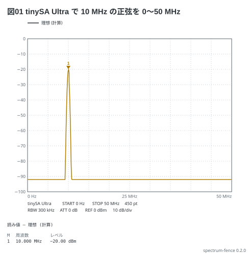
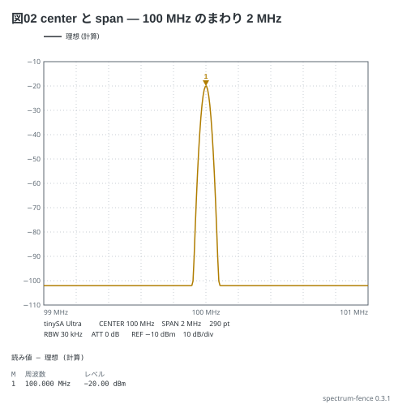
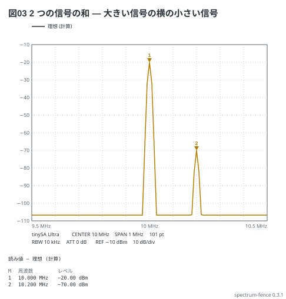
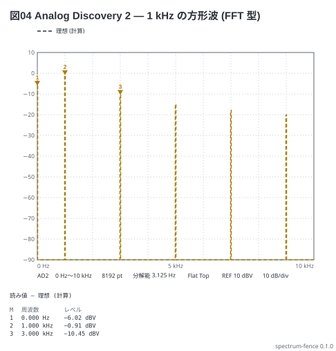
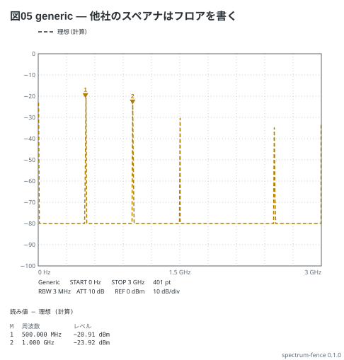
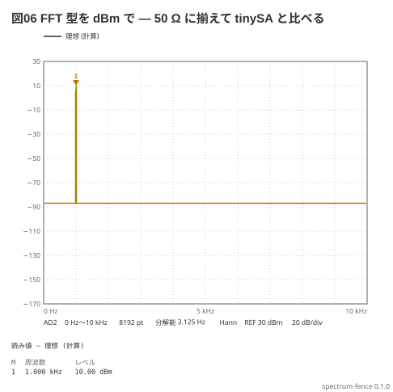
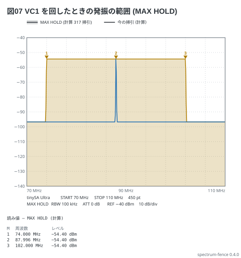
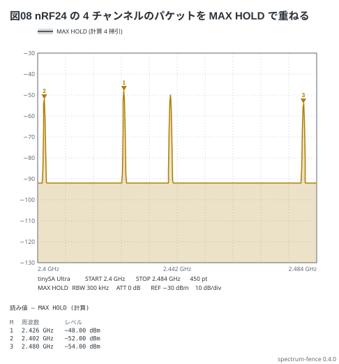

# spectrum フェンスの書き方

Markdown の ` ```spectrum ` フェンスに YAML を書くと、Markdown プレビューで
**スペクトラムアナライザの画面**になる。1 つのフェンスで 2 つの型の計器を描く —
**FFT 型** (Analog Discovery の Spectrum) と**掃引型** (tinySA)。どちらかは `device:` で決まる。
信号を波形発生器の語 (`square 100MHz -10dBm`) で書けば測る前の「見えるはずの画面」が実線で描け、
**測った CSV** (`data:`) を書けば実線で重なり、理想のほうは破線に変わる。
MAX HOLD の画面は掃引を並べた `hold:` で描く。
ここは文法の全部。1 画面にまとめた物は [02-cheatsheet.md](02-cheatsheet.md)、
形ごとの例は [examples/](../examples/README.md) にある。

## 目次

- [機種 (`device:`)](#機種-device)
- [掃引 (`sweep:` `center:` `span:`)](#掃引-sweep-center-span)
- [題 (`title:`)](#題-title)
- [信号 (`signal:`)](#信号-signal)
- [FFT 型の設定 (`samples:` `window:`)](#fft-型の設定-samples-window)
- [掃引型の設定 (`points:` `rbw:` `atten:` `lna:`)](#掃引型の設定-points-rbw-atten-lna)
- [レベルと単位 (`ref:` `scale:` `unit:` `floor:`)](#レベルと単位-ref-scale-unit-floor)
- [測った値 (`data:`)](#測った値-data)
- [マーカー (`markers:`)](#マーカー-markers)
- [MAX HOLD (`hold:`)](#max-hold-hold)
- [まだ書けないもの (注釈・delta・noise・ゼロスパン)](#まだ書けないもの-注釈deltanoiseゼロスパン)
- [見た目 (`style:`)](#見た目-style)
- [読み値](#読み値)
- [言われること](#言われること)
- [上限](#上限)

## 機種 (`device:`)

**`device:` は必須。** 計器の型で計算の道が変わるので、既定を作らない
(書かなければ「device: は … のどれかを書きます」と断り、格子だけ描く)。

| `device:` | 型 | 機種 | 範囲 | 縦軸の既定 |
| --- | --- | --- | --- | --- |
| `ad2` | FFT | Analog Discovery 2 | 0〜25 MHz | dBV、REF 0 dBV |
| `ad3` | FFT | Analog Discovery 3 | 0〜50 MHz | dBV、REF 0 dBV |
| `tinysa` | 掃引 | tinySA (Basic) | 0〜960 MHz | dBm、REF −10 dBm |
| `tinysa-ultra` | 掃引 | tinySA Ultra | 0〜5.3 GHz | dBm、REF −10 dBm |
| `generic` | 掃引 | ほかのスペアナ・SDR | 0〜10 GHz | dBm、REF −10 dBm |

- **FFT 型**は信号を標本化して窓を掛け FFT する。題は窓・分解能・リーク
- **掃引型**は信号の線スペクトルを受信機 (RBW の山・アッテネータ・LNA・ノイズフロア) でなぞる
- **片方の型にしか無いキーは、もう片方の機種では断る** (「ad2 では rbw: は書けません
  (分解能は samples: と掃引の幅で決まります。いまは 6.250 Hz)」)。キーの意味は型で変わらない
- 掃引が機種の範囲を外れたらお知らせで言う (図は描く)
- 範囲・DANL・既定の一部 (AD の帯域、tinySA の REF の既定・DANL など) は仕様表から置いた値で、
  実機でまだ確かめていない

```spectrum
title: 図01 tinySA Ultra で 10 MHz の正弦を 0〜50 MHz
device: tinysa-ultra
sweep: 0-50M 450
rbw: 300kHz
ref: 0dBm
signal: sine 10MHz -20dBm
markers:
  - 10M
```



画面は横 10 目盛・縦 10 目盛。上の 2 行 (状態の行) に機種と掃引・点数、受信機
(`RBW 300 kHz` `ATT 0 dB`) と表示 (`REF 0 dBm` `10 dB/div`) が出る。山の間の平らな所が
ノイズフロア (tinySA Ultra の RBW 300 kHz で −92 dBm)。

## 掃引 (`sweep:` `center:` `span:`)

`sweep:` は**開始-終了**。掃引型は後ろに点数を書ける (`sweep: 0-960M 450`)。
FFT 型は点数を書かない (bin の数は `samples:` と掃引の幅で決まる)。点は**実機と同じく線形**。

`center:` と `span:` は**対で**書く (`sweep:` とどちらか片方)。**`span:` は常に幅** —
開始-終了を書きたいときは `sweep:`。

```spectrum
title: 図02 center と span — 100 MHz のまわり 2 MHz
device: tinysa-ultra
center: 100MHz
span: 2MHz
points: 290
rbw: 30kHz
ref: -10dBm
signal: sine 100MHz -20dBm
markers:
  - peak
```



- 周波数は `960M` `100MHz` `300kHz` `2.4G` `0` のどれでも書ける (接頭辞か `Hz` が要る。
  素の `1000` は断る。`0` だけは単位が要らない)
- 状態の行は書いた形で出る (`START 0 Hz` `STOP 960 MHz` か `CENTER 100 MHz` `SPAN 2 MHz`)
- 書かなければ機種の範囲いっぱいで描き、そう言う。上の端は 10 GHz

## 題 (`title:`)

図の左上に出る。本文から「図01 を見る」と指せるよう、例と文書の図には
`title: 図NN …` を付けてある (ほかのフェンスと同じ作法)。60 字まで。
**題にコロンと空白の並び (`a: b` の形) を入れない** (YAML が値を読めない)。

## 信号 (`signal:`)

**波の書き方は scope と同じ** (fence-kit の波)。1 行なら 1 つ、並びなら**和** (16 本まで)。

| 形 | 例 | 線 |
| --- | --- | --- |
| `sine` | `sine 100MHz -10dBm` | 1 本 |
| `square` | `square 1kHz 1V` | 奇数次 (1/n)。`duty` を書けば偶数次も |
| `triangle` | `triangle 1kHz 1V` | 奇数次 (1/n²) |
| `sawtooth` | `sawtooth 1kHz 1V` | 全部の次数 (1/n) |
| `pulse` | `pulse 1MHz 1V duty 10%` | sinc の包絡。duty を書かなければ 25 % (言う) |
| `dc` | `dc 0.5V` | 0 Hz だけ |

- 周波数は `sweep:` やマーカーと同じ綴り — **`100M` でも `100MHz` でもよい** (`1k` `1kHz`)。
  素の数 (`1000`) は断る (`0` も波の周波数には書けない)
- **振幅は peak** (発生器の Amplitude)。`2Vpp` は半分、`0.707Vrms` は sine だけ。
  **`-10dBm` は 50 Ω に入れた正弦の電力** (peak 0.1 V) で、方形波に書いても同じ peak に直す —
  方形波の基本波は 4/π 倍なので −7.90 dBm に立つ
- `offset 0.5V` (0 Hz の線になる)・`phase` (画面は電力しか見ないので効かない)・`duty` は順不同
- **操作 (`| rc 1ms` など) は書けない** — 加工した波は scope で描く
- 同じ周波数の線は電力で足す (波どうしの位相は決まっていないので)

```spectrum
title: 図03 2 つの信号の和 — 大きい信号の横の小さい信号
device: tinysa-ultra
center: 10MHz
span: 1MHz
points: 101
rbw: 10kHz
ref: -10dBm
signal:
  - sine 10MHz -20dBm
  - sine 10.2MHz -70dBm
markers:
  - 10M
  - 10.2M
```



M1 −20.00 dBm、M2 −70.00 dBm。フロアは RBW 10 kHz の −106.8 dBm。RBW を広げると
小さい信号の山は大きい信号の裾とフロアに埋もれる。

入力の上限 (tinySA は +10 dBm、Ultra は +6 dBm の電力の和、AD は ±25 V の peak の和) を
超えればお知らせで言う。

## FFT 型の設定 (`samples:` `window:`)

`ad2` `ad3` だけ。**標本化の速さは掃引の終わり × 2.56**、分解能 (bin の幅) は
その ÷ `samples:`。0〜20 kHz・8192 点なら 20 kHz × 2.56 ÷ 8192 = 6.25 Hz。

| キー | 書くもの | 既定 |
| --- | --- | --- |
| `samples` | 1024〜65536 の 2 の冪 (`samples: 8192`)。数えた数なので単位は無い | 8192 |
| `window` | `rect` (Rectangular) / `hann` / `flattop` (Flat Top) | `flattop` |

- 窓の利得は割り戻すので、**bin に乗った正弦は窓によらず同じ値**。bin の間に落ちた正弦は
  `rect` で最大 3.9 dB 低く、`flattop` ではほぼ正しい (山は太い)
- `samples:` `window:` を書かなければ既定で描き、信号か `floor:` があればそう言う
- Nyquist (fs ÷ 2) より上の線は落とす (実機と同じく折り返さない)
- bin が 20 個に届かない狭い掃引は言う

```spectrum
title: 図04 Analog Discovery 2 — 1 kHz の方形波 (FFT 型)
device: ad2
sweep: 0-10kHz
samples: 8192
window: flattop
ref: 10dBV
signal: square 1kHz 1V offset 0.5V
markers:
  - 0
  - 1kHz
  - 3kHz
```



M1 は offset の 0.5 V (−6.02 dBV)、M2 は基本波 (4/π V peak = −0.91 dBV)、M3 は 3 次 (−10.45 dBV)。

## 掃引型の設定 (`points:` `rbw:` `atten:` `lna:`)

`tinysa` `tinysa-ultra` `generic` だけ。

| キー | 書くもの | 既定 |
| --- | --- | --- |
| `points` | 点数。`sweep:` の後ろに書いてもよい (片方だけ) | 機種の既定 (290 / 450 / 450) |
| `rbw` | 分解能帯域 (`300kHz`)。**メニューにある値だけ** | 掃引の幅 ÷ 点数 以上の最小の選択肢 (言う) |
| `atten` | アッテネータ (`20dB`) | 0 dB |
| `lna` | `on` / `off` (tinySA Ultra だけ。利得 20 dB) | `off` |

| 機種 | 点数 | RBW |
| --- | --- | --- |
| `tinysa` | 51 / 101 / 145 / 290 | 3k / 10k / 30k / 100k / 300k / 600k Hz |
| `tinysa-ultra` | 51 / 101 / 145 / 290 / 450 | 200 / 1k / 3k / 10k / 30k / 100k / 300k / 600k / 850k Hz |
| `generic` | 51〜1001 の整数 | 1 Hz〜10 MHz の何でも |

- 選択肢に無い点数は一番近い選択肢に丸めて言う。メニューに無い RBW は読めない
- **フロア = 機種の DANL (RBW 30 kHz で −102 dBm) + 10 log10(RBW ÷ 30 kHz) + ATT − LNA の利得**。
  RBW を 1/10 にするとフロアが 10 dB 下がり、アッテネータはフロアだけを上げる (信号の読みは補正される)
- `generic` は DANL を持たないので**フロアを `floor:` で書く** (書かなければ −100 dBm で描いて言う)。
  tinySA の 2 つに `floor:` は書けない
- 山の形は RBW の幅のガウス (−3 dB が ±RBW/2)。点の間に落ちた線も、その点が受け持つ幅の
  最大を取るので消えない

```spectrum
title: 図05 generic — 他社のスペアナはフロアを書く
device: generic
sweep: 0-3G 401
rbw: 3MHz
atten: 10dB
ref: 0dBm
floor: -90dBm
signal: square 500MHz -20dBm duty 25%
markers:
  - peak
  - 1G
```



duty 25 % の方形波は 4 次ごとに線が消える (2 GHz)。フロアは `floor:` の −90 dBm に ATT の 10 dB を
足した −80 dBm。

## レベルと単位 (`ref:` `scale:` `unit:` `floor:`)

| キー | 書くもの | 既定 |
| --- | --- | --- |
| `ref` | 格子の上端 (`-10dBm` `0dBV`) | 機種の既定 (上の表) |
| `scale` | 1 目盛の幅 (`10dB`。0.1〜50) | 10 dB |
| `unit` | 縦軸の単位 `dBm` (50 Ω の電力) / `dBV` (電圧の rms) | FFT 型は dBV、掃引型は dBm |
| `floor` | 理想のノイズフロア (`-100dBV`)。FFT 型と `generic` だけ | 無し (FFT 型) / −100 dBm (generic) |

- **単位を付ける** (`ref: -10` は断る)。dBm と dBV は **+13.01 dB** 違う (50 Ω で 1 V rms = +13.01 dBm)。
  `ref:` を `unit:` と違う単位で書けば換算する
- **同じ波は 2 つの型で同じ dBm になる** (FFT 型を `unit: dBm` にして比べる)
- 見た目の既定 (`ref:` `scale:` `unit:`) は状態の行と目盛に出るので、お知らせでは言わない
- ただし**一番高い山が REF より 3 目盛以上下か、REF より上で切れる**ときは、書く `ref:` の値を添えて言う
  (「一番高い山 (−27.10 dBm、686.000 kHz) は REF (10 dBm) より 3.7 目盛下です (ref: -10dBm なら上端から 1.7 目盛)」)。
  山は `data:` があれば実測、無ければ理想。目盛は `scale:` で数える

```spectrum
title: 図06 FFT 型を dBm で — 50 Ω に揃えて tinySA と比べる
device: ad2
sweep: 0-10kHz
samples: 8192
window: hann
unit: dBm
ref: 30dBm
scale: 20dB
floor: -100dBV
signal: sine 1kHz 1V
markers:
  - 1kHz
```



1 V peak の正弦は 0.707 V rms = −3.01 dBV = **+10.00 dBm**。平らな所は `floor:` の −100 dBV (= −86.99 dBm)。

## 測った値 (`data:`)

`data:` に **2 列 (周波数・レベル) の CSV / TXT** のファイル名を書くと、同じ色の**実線**で重なり、
マーカーは測った点を読む (見出しが「実測」に変わる)。

```yaml
data: 11-12-fm.csv
```

- **`.md` と同じ場所の通常のファイルだけ**。`/` や `..` は書けず、**シンボリック
  リンクも辿らない**。1 MB・10001 行まで
- 読むのは**宿主** — CLI は入力の `.md` の隣、VS Code の拡張はプレビューしている
  文書の隣。**playground と web 版の VS Code では読めない** (お知らせで言い、理想だけ描く)
- **tinySA の SAVE TRACES** — 見出し無し、Hz と dBm (`unit:` を書けばその単位で読む)。
  値が MHz で書かれているように見えれば MHz として読み、そう言う
- **WaveForms の Spectrum の Export** — `#` の頭書き (読み捨てる) と見出し
  `Frequency (Hz),Trace 1 (dBV)`。見出しの単位 (`(kHz)` `(MHz)` `(GHz)`、`(dBm)` `(dBV)`) を読む
- 区切りは `,` / `;` / タブ。列が 2 つでない・周波数が戻る・小数点がコンマ、は断る (お知らせ)
- 描くのは掃引の中の点だけ

例 ([examples/05-antenna.md](../examples/05-antenna.md)) に計算で作った CSV がある。

## マーカー (`markers:`)

周波数か `peak` で 4 つまで (M1〜M4)。1 つなら `markers: peak` と 1 行でも書ける。

```yaml
markers:
  - 100M        # 一番近い点に吸い付く
  - 30.5MHz
  - 0           # 直流
  - peak        # 一番高い点
```

- **周波数は一番近い点に吸い付く** (実機と同じ)。線がその点の受け持つ幅にあれば、
  読み値の周波数は線の周波数 (`100.000 MHz`)
- `peak` は一番高い点。`data:` があれば実測の点から選ぶ
- 掃引の外のマーカーは描かずに言う
- 点の上に ▼ と番号が付く (格子の上の縁に近ければ ▲ を点の下に返す)

## MAX HOLD (`hold:`)

tinySA の MAX HOLD (掃引を重ねて、点ごとの最大を残す) は `hold:` で書く。
**掃引ごとの信号を並べれば、点ごとの最大を包絡として描く。** 機種は選ばない
(掃引型も FFT 型 — WaveForms の Maximum — も同じ書き方)。

```yaml
signal: sine 88MHz -54.4dBm            # 今の掃引 (任意)
hold:
  - sine 74MHz..102MHz -54.4dBm        # 波を 74 から 102 MHz まで動かした掃引の全部
  - sine 90MHz -50dBm                  # 1 回の掃引 (波は signal: と同じ綴り)
  - [sine 80MHz -60dBm, sine 82MHz -60dBm]   # 1 回の掃引に波が複数 (和)
```

- **`hold:` の 1 行は 1 回の掃引** (`[波, 波]` なら 1 回の掃引の波の和)。1 行だけなら並びにしなくてよい
- **`from..to`** (`sine 74MHz..102MHz -54.4dBm`) は、周波数を動かしたときの掃引を全部積む
  (VC を回したときの発振など。**形・振幅・duty はそのまま動く**)。刻みを書かなければ
  **掃引の点ごと**に置く (山の平らな頂が途切れない)。`74MHz..102MHz/2MHz` と刻みも書ける —
  RBW より粗い刻みは山が離れる (言う)。範囲は 1 行に 1 つ、`[波, 波]` の中には書けない
- **FFT 型は刻みを書く** (`sine 1kHz..9kHz/2kHz 1V`)。位置ごとに FFT をするので、積めるのは 32 掃引まで
  (掃引型は 1000 掃引まで。超えたら打ち切って言う)
- 描くのは**保持したトレース**: 1 本目の色の線と、その下の薄い塗り。**`signal:` (今の掃引) も保持に入り**、
  書けば 2 本目の色の線で重なる。書かなければ今の掃引は描かない
- **マーカーは保持したトレースを読む** (実機のマーカーを MAX HOLD のトレースに置いたときと同じ)。
  見出しは「読み値 — MAX HOLD (計算)」、凡例は「MAX HOLD (計算 N 掃引)」、状態の行に `MAX HOLD`
- `data:` とは一緒に書けない (測った CSV はすでに保持したトレース)。言って `hold:` を外す

```spectrum
title: 図07 VC1 を回したときの発振の範囲 (MAX HOLD)
device: tinysa-ultra
sweep: 70M-110M 450
rbw: 100kHz
ref: -40dBm
signal: sine 88MHz -54.4dBm
hold: sine 74MHz..102MHz -54.4dBm
markers: [74M, 88M, 102M]
```



74〜102 MHz の間が−54.40 dBm の平らな帯になる (山の幅は RBW 100 kHz)。青い線が今の掃引 (88 MHz)。
M1〜M3 はどれも保持したトレースの値。

チャンネルが離れているときは 1 行ずつ書く。

```spectrum
title: 図08 nRF24 の 4 チャンネルのパケットを MAX HOLD で重ねる
device: tinysa-ultra
sweep: 2400M-2484M 450
rbw: 300kHz
ref: -30dBm
hold:
  - sine 2402MHz -52dBm
  - sine 2426MHz -48dBm
  - sine 2440MHz -50dBm
  - sine 2480MHz -54dBm
markers: [peak, 2402M, 2480M]
```



M1 は一番高い ch 26 (2426 MHz、−48 dBm)。

## まだ書けないもの (注釈・delta・noise・ゼロスパン)

キーや語は予約してあり、**書くと「まだ書けません」と断る** (黙って捨てない)。

| 書き方 | 言われること |
| --- | --- |
| `notes:` | notes: はまだ書けません |
| `markers:` の `- delta 1M` / `- noise 1M` | マーカーの delta はまだ書けません |
| `span: 0` (ゼロスパン) | span: 0 (ゼロスパン) はまだ描けません |

## 見た目 (`style:`)

| 項目 | 書くもの | 既定 |
| --- | --- | --- |
| `theme` | `light` `dark` `mono` (白黒で刷る) | `light` |
| `width` | 図の幅 (px、120〜4000) | 描いた大きさ |
| `stamp` | 右下に処理系の版を刻む (`on` / `off`) | `on` |
| `debug` | お知らせを図の下の帯に出す (`on` / `off`) | `on` |

テーマだけなら `style: dark` と 1 語で書ける。

## 読み値

図の下の表は、**`data:` があれば測った点**、無ければ**理想の点**からマーカーを読む。
見出しにどちらか (「読み値 — 理想 (計算)」「読み値 — 実測 (11-12-fm.csv)」) を書く。
書式は実機のマーカーと同じ (`100.000 MHz` `−7.90 dBm`。負の印は − (U+2212))。

```text
  読み値 — 理想 (計算)
  M  周波数       レベル
  1  100.000 MHz  −7.90 dBm
```

CLI の `check` / `render` は同じ表を標準出力に出す。**図を見る前に、この数を本文の
「見るべき値」の表と突き合わせる**。

```bash
npx spectrum-fence check examples
```

## 言われること

読めなかった行は図の下の帯に、**行番号・行の中身・綴りを指す印**つきで出る。
格子は必ず描く (読めた所まで)。お知らせ (読めているが思ったとおりに出ない) は
同じ帯に、弱く出る。

| 言われること | 種類 |
| --- | --- |
| `device:` が無い・知らない機種 | 読めない |
| 知らないキー・単位の無い数・範囲の外・メニューに無い RBW | 読めない |
| 型に無いキー (`ad2` の `rbw:`、`tinysa` の `window:` など)、tinySA の `floor:`、LNA の無い機種の `lna: on` | 読めない |
| `sweep:` と `center:` の両方・`center:` だけ、点数を `sweep:` と `points:` の両方に | 読めない |
| `signal:` の操作 (`\|`) | 読めない |
| `hold:` の範囲 (始めが終わりより上・刻みが 0・FFT 型で刻み無し・`[波, 波]` の中の範囲)、`data:` と一緒 | 読めない |
| `hold:` の刻みが RBW より粗い・掃引が多すぎて打ち切った | お知らせ |
| `sweep:` `points:` `samples:` `window:` `rbw:` を書かなかった (何で描いたか)、generic のフロア、pulse の duty | お知らせ |
| 掃引が機種の範囲の外・点数を選択肢に丸めた・マーカーが掃引の外・入力の上限を超えた・bin が少ない | お知らせ |
| `data:` が読めない・見つからない・掃引の中に点が無い・MHz とみて読んだ | お知らせ |
| 一番高い山が REF より 3 目盛以上下・REF より上で切れる (書く `ref:` の値を添える) | お知らせ |

わざと読めなく書いた例は [examples/errors/](../examples/errors/01-unreadable.md)。

## 上限

| 何 | 上限 |
| --- | --- |
| `signal:` の波 | 16 |
| `hold:` の行 | 64 (範囲 1 行で何回でも動かせる) |
| `hold:` の掃引 | 掃引型 1000・FFT 型 32 (超えれば打ち切って言う) |
| 線 (全部の波の高調波の和) | 4096 (超えれば打ち切って言う) |
| 掃引型の点数 | 51〜1001 (機種の選択肢の中) |
| FFT 型の `samples:` | 1024〜65536 |
| 周波数の上の端 | 10 GHz |
| レベル (`ref:` `floor:`) | −200〜40 |
| `scale:` | 0.1〜50 dB |
| マーカー | 4 (実機と同じ) |
| `data:` | 1 MB・10001 行 |
| 題 | 60 字 |
