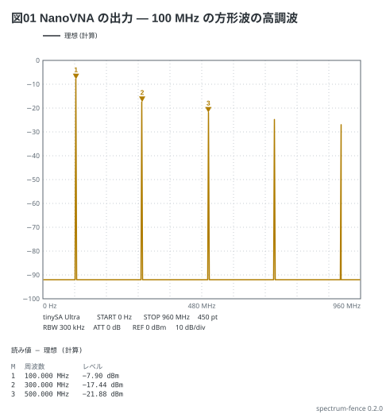

# NanoVNA の出力の高調波 — tinySA Ultra

NanoVNA の CH0 は 50 MHz を超えると**方形波**を出す (高調波で上の周波数を作る)。
100 MHz にした出力を tinySA Ultra で 0〜960 MHz まで見ると、奇数次の高調波が
1/n ずつ下がって並ぶ (本の 11-4)。

```spectrum
title: 図01 NanoVNA の出力 — 100 MHz の方形波の高調波
device: tinysa-ultra
sweep: 0-960M 450
rbw: 300kHz
ref: 0dBm
signal: square 100MHz -10dBm
markers:
  - 100M
  - 300M
  - 500M
```



読み方:

- 振幅の `-10dBm` は **同じ peak の正弦の電力** (peak 0.1 V)。方形波の基本波は
  その 4/π 倍なので −7.90 dBm、3 次は 1/3 で −17.44 dBm、5 次は 1/5 で −21.88 dBm
- 山の間はフロア。RBW 300 kHz の tinySA Ultra は −102 + 10 log10(300/30) = **−92 dBm**
