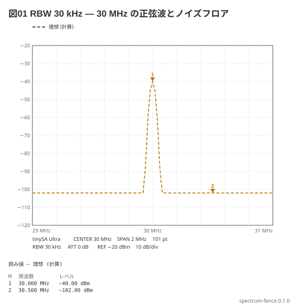
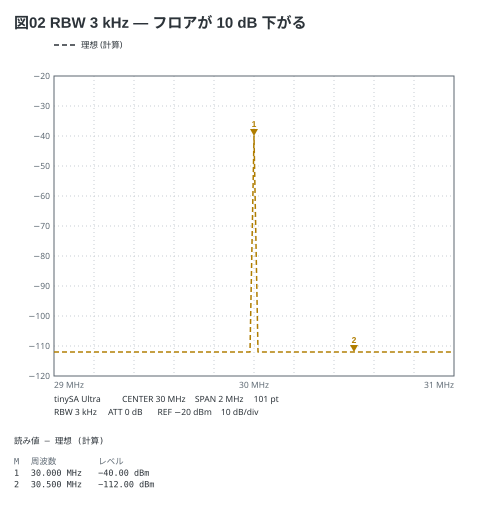
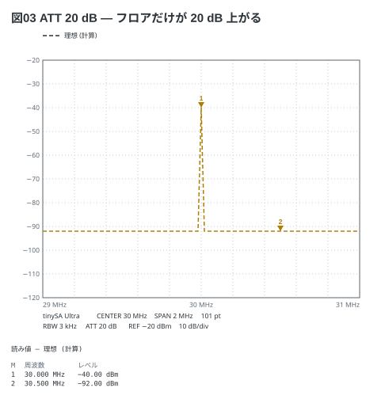

# RBW とノイズフロア、アッテネータ — tinySA Ultra

30 MHz の正弦 (−40 dBm) を同じ掃引で見て、**RBW を 1/10 にするとフロアが 10 dB 下がる**
(本の 11-2)、**アッテネータを入れるとフロアだけが上がる** (11-3) ことを並べる。
山の高さ (M1) は 3 枚とも −40 dBm のまま。

```spectrum
title: 図01 RBW 30 kHz — 30 MHz の正弦波とノイズフロア
device: tinysa-ultra
center: 30MHz
span: 2MHz
points: 101
rbw: 30kHz
ref: -20dBm
signal: sine 30MHz -40dBm
markers:
  - peak
  - 30.5MHz
```



```spectrum
title: 図02 RBW 3 kHz — フロアが 10 dB 下がる
device: tinysa-ultra
center: 30MHz
span: 2MHz
points: 101
rbw: 3kHz
ref: -20dBm
signal: sine 30MHz -40dBm
markers:
  - peak
  - 30.5MHz
```



```spectrum
title: 図03 ATT 20 dB — フロアだけが 20 dB 上がる
device: tinysa-ultra
center: 30MHz
span: 2MHz
points: 101
rbw: 3kHz
atten: 20dB
ref: -20dBm
signal: sine 30MHz -40dBm
markers:
  - peak
  - 30.5MHz
```



読み方:

- フロア = −102 dBm (RBW 30 kHz) + 10 log10(RBW ÷ 30 kHz) + ATT。図01 は −102、図02 は −112、図03 は −92 dBm
- アッテネータは信号の読みを補正するので M1 は変わらない。**入れて同じだけ下がる山は本物ではない** (11-10)
