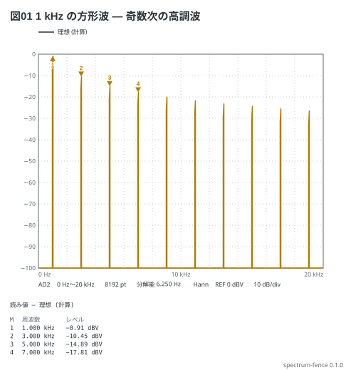

# 方形波の高調波 — Analog Discovery の Spectrum

Wavegen の 1 kHz・1 V の方形波を Scope の CH1 に繋ぎ、Spectrum で 0〜20 kHz を見る
(AD の 4-2)。FFT 型なので縦軸は dBV (rms)、分解能は 20 kHz × 2.56 ÷ 8192 = 6.25 Hz。

```spectrum
title: 図01 1 kHz の方形波 — 奇数次の高調波
device: ad2
sweep: 0-20kHz
samples: 8192
window: hann
signal: square 1kHz 1V
markers:
  - 1kHz
  - 3kHz
  - 5kHz
  - 7kHz
```



読み方:

- 基本波は peak 4/π V = 0.900 V rms = **−0.91 dBV**。3 次は 1/3 で −10.45 dBV、
  5 次 −14.89 dBV、7 次 −17.81 dBV
- 偶数次が無いのは duty 50% の方形波だから (`duty 25%` にすると偶数次も立つ)
