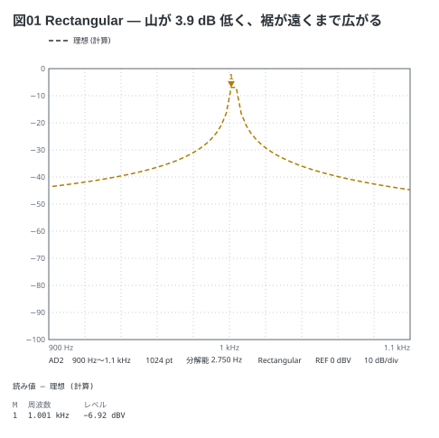
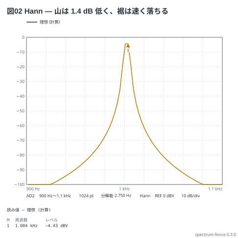
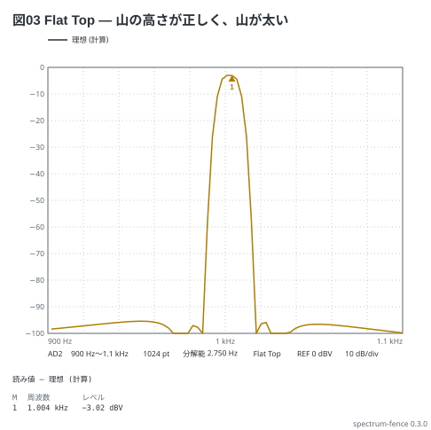

# 窓関数 — 同じ正弦を 3 つの窓で

1002.375 Hz の正弦は、分解能 2.75 Hz (1.1 kHz × 2.56 ÷ 1024) の bin (1001.000 Hz と
1003.750 Hz) の**ちょうど間**に落ちる。同じ波を 3 つの窓で FFT すると、山の高さと裾の広がりが入れ替わる (AD の 4-3)。
正しい値は 1 V peak = −3.01 dBV。

```spectrum
title: 図01 Rectangular — 山が 3.9 dB 低く、裾が遠くまで広がる
device: ad2
center: 1kHz
span: 200Hz
samples: 1024
window: rect
signal: sine 1002.375Hz 1V
markers:
  - peak
```



```spectrum
title: 図02 Hann — 山は 1.4 dB 低く、裾は速く落ちる
device: ad2
center: 1kHz
span: 200Hz
samples: 1024
window: hann
signal: sine 1002.375Hz 1V
markers:
  - peak
```



```spectrum
title: 図03 Flat Top — 山の高さが正しく、山が太い
device: ad2
center: 1kHz
span: 200Hz
samples: 1024
window: flattop
signal: sine 1002.375Hz 1V
markers:
  - peak
```



読み方:

- 振幅を読むなら Flat Top、近い 2 つの山を分けるなら Rectangular か Hann
