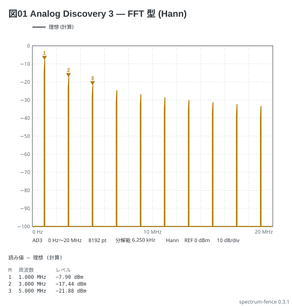
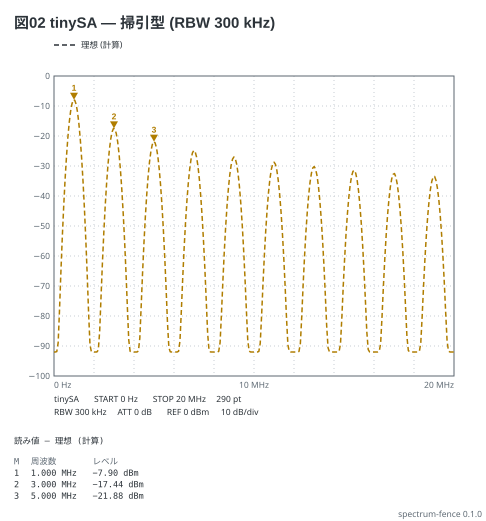

# FFT 型と掃引型 — 同じ方形波を 2 つの計器で

同じ 1 MHz・−10 dBm の方形波を、Analog Discovery 3 の Spectrum (FFT 型) と tinySA
(掃引型) で見る (本の 11-5)。**高調波の高さは dBm にそろえると同じ**になり、違うのは
山の形 (窓の裾か RBW の山か) とフロア (受信機の DANL) だけ。

```spectrum
title: 図01 Analog Discovery 3 — FFT 型 (Hann)
device: ad3
sweep: 0-20MHz
samples: 8192
window: hann
unit: dBm
ref: 0dBm
signal: square 1MHz -10dBm
markers:
  - 1M
  - 3M
  - 5M
```



```spectrum
title: 図02 tinySA — 掃引型 (RBW 300 kHz)
device: tinysa
sweep: 0-20M 290
rbw: 300kHz
ref: 0dBm
signal: square 1MHz -10dBm
markers:
  - 1M
  - 3M
  - 5M
```



読み方:

- どちらも M1 −7.90 dBm、M2 −17.44 dBm、M3 −21.88 dBm
- 掃引型の山の幅は RBW (300 kHz)、フロアは RBW で決まる −92 dBm。FFT 型の山は窓の裾で細い
- FFT 型の縦軸は既定で dBV (電圧)。`unit: dBm` で 50 Ω の電力にそろえて比べる
