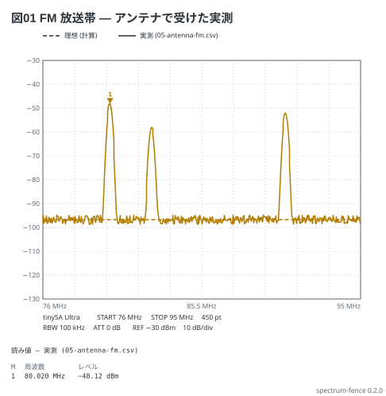

# アンテナで受けた FM 放送帯 — 実測を重ねる

tinySA Ultra にアンテナを繋ぎ、FM 放送帯 (76〜95 MHz) を掃引して SAVE TRACES で CSV に
書き出す (本の 11-12)。`data:` にそのファイルを書くと、**実測が実線で重なり、`peak` の
マーカーは実測の点を読む**。`signal:` が無いので、理想はフロア (破線) だけ。

**`05-antenna-fm.csv` は計算で作った値で、実測ではない** (`node scripts/fakeData.mjs` が書く。
フロアに ±2 dB の揺れと 3 つの局)。

```spectrum
title: 図01 FM 放送帯 — アンテナで受けた実測
device: tinysa-ultra
sweep: 76M-95M 450
rbw: 100kHz
ref: -30dBm
data: 05-antenna-fm.csv
markers:
  - peak
```



読み方:

- 破線は RBW 100 kHz のフロア (−96.8 dBm)。実測のフロアがこの ±2 dB で揺れていれば、
  計器の性質どおり
- 帯の読み値は「実測 (05-antenna-fm.csv)」。M1 は一番強い局
- playground と web 版の拡張は隣のファイルを読めないので、「読めません」と言って破線だけ描く
