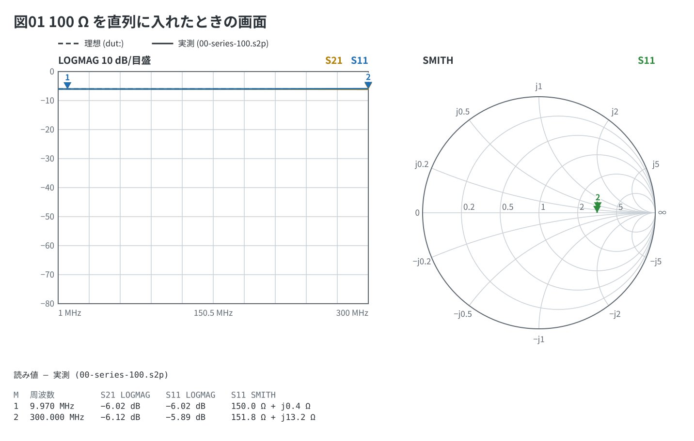

# VNA Fence

[English](README.md) | [日本語](README.ja.md)

Markdown の ` ```vna ` フェンス (YAML) を **VNA (NanoVNA) の画面** — Log Mag・
Smith チャート・SWR・位相・群遅延・インピーダンス・TDR — として描くライブラリと
CLI。VS Code では拡張 `tommie-fence` の中で動く。



## 何のためか

NanoVNA で測る実験のノートには、**測る前に「こう見えるはず」の画面**と、
**測った後の画面**が要る。画面写しは測った後にしか無い。理想の模型を 1 行書けば
フェンスがトレースを計算し、保存した Touchstone を指せば実測が重なる。

```yaml
device: h4
sweep: 1M-300M 101
dut: series R 100            # 理想の模型 → 破線
data: 3-1-100ohm.s2p         # 測った値 (.md の隣) → 実線
traces:
  - S21 logmag
  - S11 logmag
  - S11 smith
markers:
  - 10M
  - 300M
```

- **模型** (`dut:`) は CH0 から CH1 へ縦続する梯子。`series` / `shunt` の R・L・C
  (寄生分 `esr` `esl` `cp` つき)、損失の無い線路とスタブ、1 端子にする `open` / `short`
- **測った値** (`data:`) は Touchstone 1.x (`.s1p` / `.s2p`、RI / MA / DB)。
  **Markdown と同じ場所のファイルだけ**。core はファイルを開かず、宿主が読む
  (CLI と、プレビューしている文書の隣を読む VS Code の拡張)
- **トレースは NanoVNA のメニューの名前** (`logmag` `phase` `delay` `smith` `polar`
  `swr` `linear` `r` `x` `z` `tdr`)、4 本まで。同じ単位のトレースは 1 つの枠に重なる
- **マーカー**の読み値は図の下に NanoVNA の書式で出る
  (`10.000 MHz  −6.02 dB  150.0 Ω + j0.0 Ω`)。実測があれば実測から
- 機種 (`h4` / `v2` / `plus4`) は、掃引が範囲を外れたときに**言う**ためだけに使う

## 兄弟との違い

| | 描くもの | 元になるもの |
| --- | --- | --- |
| [circuit-fence](../circuit-fence/) | 回路図 | 番地に置いた部品 |
| [breadboard-fence](../breadboard-fence/) / [perfboard-fence](../perfboard-fence/) | 板の実体配線図 | 穴に挿した部品 |
| [copper-fence](../copper-fence/) | 銅張り基板 | mm で書いた銅 |
| vna-fence | **計器の画面** | **模型と Touchstone** |

言語は別、作法は同じ (YAML のフェンス、Markdown の行と中身つきの報告)。
ネットリスト・ERC・掴んで動かすマップは無い。

## 使い方

文法の全部は [docs/01-syntax.md](docs/01-syntax.md)、例は [examples/](examples/README.md)。

```bash
npx vna-fence check  doc.md             # 読めたか、マーカーの読み値
npx vna-fence render doc.md --out out   # SVG を書き出す
```

npm には無い。Release の tgz を `file:` で指す。
ライブラリの入口は `vna-fence/core` (`renderVna` / `extractVnaFences`)。

## ライセンス

MIT
