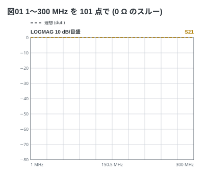
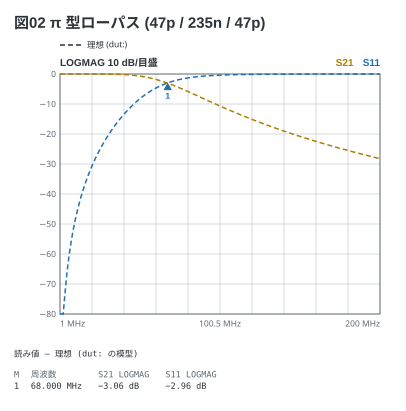
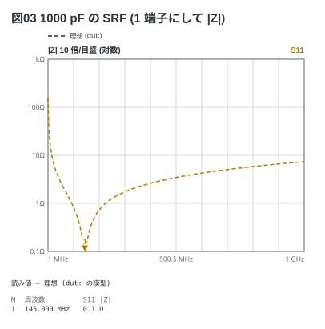
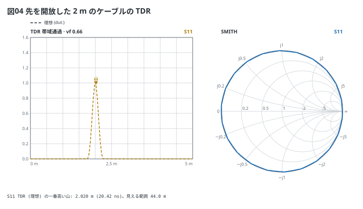
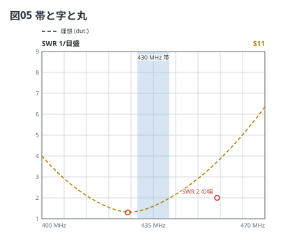

# vna フェンスの書き方

Markdown の ` ```vna ` フェンスに YAML を書くと、Markdown プレビューで
**VNA (NanoVNA) の画面**になる — S21 / S11 の Log Mag、Smith チャート、SWR、
位相、群遅延、インピーダンス、TDR。**理想の模型** (`dut:`) を書けば測る前の
「見るべき値」が破線で、**測った Touchstone** (`data:`) を書けば実線で重なる。
ここは文法の全部。形ごとの例は [examples/](../examples/README.md) にある。

## 目次

- [機種と掃引 (`device:` `sweep:`)](#機種と掃引-device-sweep)
- [題 (`title:`)](#題-title)
- [理想の模型 (`dut:`)](#理想の模型-dut)
- [測った値 (`data:`)](#測った値-data)
- [トレース (`traces:`)](#トレース-traces)
- [マーカー (`markers:`)](#マーカー-markers)
- [注釈 (`notes:`)](#注釈-notes)
- [見た目 (`style:`)](#見た目-style)
- [読み値](#読み値)
- [言われること](#言われること)
- [上限](#上限)

## 機種と掃引 (`device:` `sweep:`)

`sweep:` は**開始-終了 点数**。点は**実機と同じく線形**に並ぶ。点数を省くと 101。

```vna
sweep: 1M-300M 101
title: 図01 1〜300 MHz を 101 点で (0 Ω のスルー)
dut: series R 0
traces:
  - S21 logmag
```



周波数は `50k` `1M` `2.4G` `1575MHz` `10000000` のどれでも書ける。
`device:` は機種で、**掃引が機種の範囲を外れたらお知らせで言う** (図は描く)。

| `device:` | 機種 | 範囲 |
| --- | --- | --- |
| `h4` (既定) | NanoVNA-H4 | 50 kHz〜1.5 GHz |
| `v2` | NanoVNA V2 | 50 kHz〜3 GHz |
| `plus4` | NanoVNA V2 Plus4 | 50 kHz〜4.4 GHz |

`sweep:` を書かなければ機種の範囲いっぱい (101 点) で描き、そう描いたことを言う。

## 題 (`title:`)

図の左上に出る。本文から「図01 を見る」と指せるよう、例と文書の図には
`title: 図NN …` を付けてある (板のフェンスと同じ作法)。

## 理想の模型 (`dut:`)

**CH0 から CH1 へ、書いた順に縦続**する (ABCD 行列の掛け算)。1 つなら 1 行、
梯子なら並びで書く。

```vna
sweep: 1M-200M 201
title: 図02 π 型ローパス (47p / 235n / 47p)
dut:
  - shunt C 47p
  - series L 235n
  - shunt C 47p
traces:
  - S21 logmag
  - S11 logmag
markers:
  - 68M
```



| 書き方 | 意味 |
| --- | --- |
| `series R 100` | 直列の抵抗 (置き方を省くと series) |
| `shunt C 47p` | 並列 (GND へ) のコンデンサ |
| `series L 100n` | 直列のコイル |
| `series C 10p esr 0.2 esl 1n` | 寄生分つき。`esr` `esl` は直列に付く |
| `series L 1u cp 1.5p` | `cp` は全体に並列に付く (巻線の容量・水晶の電極) |
| `line 50 1m vf 0.66` | 伝送線路 (Z0・長さ・速度係数。損失は見ない) |
| `shunt line 50 34.4cm vf 0.66 open` | スタブ (先を `open` か `short`) |
| `open` / `short` | **模型の終わり**。その先は CH1 に繋がらない 1 端子 |

値の綴り:

- **R** は板のフェンスと同じ (`100` `4k7` `1M` `50Ω`)。0 Ω も書ける
- **L と C** は SI の接頭辞 (`47p` `100n` `0.1u` `2.2µ` `20f`)。**接頭辞の無い数は
  F / H のまま** (`C 47` は 47 F) なので、範囲で書き間違いを弾く
- **長さ**は単位が要る (`1m` `25cm` `300mm`)

**部品そのもののインピーダンスを見るなら、最後に `short`** を書いて 1 端子にする
(`series C 1000p esl 1.2n` + `short` の S11 が部品の Z)。書かないと CH1 の 50 Ω が
直列に見える。

```vna
sweep: 1M-1G 401
title: 図03 1000 pF の SRF (1 端子にして |Z|)
dut:
  - series C 1000p esr 0.1 esl 1.2n
  - short
traces:
  - S11 z
markers:
  - 145M
```



## 測った値 (`data:`)

`data:` に **Touchstone** (`.s1p` / `.s2p`) のファイル名を書くと、同じ色の**実線**で
重なる。NanoVNA-Saver・実機の SD 保存・scikit-rf・QucsStudio が書く 1.x の形
(`# HZ S RI R 50`。`RI` `MA` `DB`、`HZ` 〜 `GHZ`) を読む。

```yaml
data: 3-1-100ohm.s2p
```

- **`.md` と同じ場所の通常のファイルだけ**。`/` や `..` は書けず、**シンボリック
  リンクも辿らない** (共有された `.md` やリポジトリに置かれた道やリンクで、外のファイルを
  読ませない)。1 MB・10001 点まで
- 読むのは**宿主** — CLI は入力の `.md` の隣、VS Code の拡張はプレビューしている
  文書の隣。**playground と web 版の VS Code では読めない** (お知らせで言い、理想だけ描く)
- 掃引の外の点は描かない。`.s1p` には S21 が無い
- `.s2p` の並びは Touchstone の決まりどおり **S11 S21 S12 S22**。雑音パラメータの表 (周波数が
  戻った所から後ろ。メーカーのトランジスタのファイル) は読み捨てる

例 ([examples/00-series.md](../examples/00-series.md)) に計算で作った `.s2p` がある。

## トレース (`traces:`)

**NanoVNA のメニューと同じ名前**で、4 本まで。書かなければ `S21 logmag` `S11 logmag`
`S11 smith` の 3 本。

| 形式 | 見るもの | 描ける S | 枠 |
| --- | --- | --- | --- |
| `logmag` | 振幅 (dB)。上が 0 dB、10 dB/目盛 | S11 / S21 | dB |
| `phase` | 位相 (度)。±180° で折り返す | S11 / S21 | 度 |
| `delay` | 群遅延 (ns) | S11 / S21 | ns |
| `linear` | \|S\| (0〜1) | S11 / S21 | linear |
| `polar` | 極 | S11 / S21 | 丸 |
| `smith` | Smith チャート | S11 | 丸 |
| `swr` | SWR | S11 | SWR |
| `r` `x` `z` | インピーダンスの実部・虚部・大きさ (Ω) | S11 | Ω |
| `tdr` | 時間領域 (距離)。`S11 tdr vf 0.66` | S11 | TDR |

- **同じ単位のトレースは 1 つの枠に重なる** (S21 と S11 の dB は 1 枚)。実機は 4 本を
  尺度違いで 1 つの格子に重ねるが、紙では読めないので分けた
- 色は**書いた順** (実機の 1〜4 本目の黄・水色・緑・紫。白い地では濃くしてある)
- **|Z| だけの枠は対数** (10 倍ごと)。R や X を混ぜると線形 (値の 5〜95% で目盛を決め、
  外れた値は縁に沿う)
- S22 / S12 は書けない (実機は測らない。治具を裏返して S11 / S21 で測る)

TDR は S11 に Kaiser 窓 (β = 6) を掛けて逆 FFT した**帯域通過のインパルス応答**。
山の位置が反射の場所で、開放か短絡かは見分けない。**等間隔の掃引が要る**。
横軸は一番遠い反射の 2 倍まで (見える範囲は図の下の 1 行)。

```vna
sweep: 1M-900M 401
title: 図04 先を開放した 2 m のケーブルの TDR
dut:
  - line 50 2m vf 0.66
  - open
traces:
  - S11 tdr vf 0.66
  - S11 smith
```



## マーカー (`markers:`)

周波数で 4 つまで。どの枠にも ▽ と番号が付き、**読み値は図の下の表**に出る
(実機は画面の左上)。格子の上の縁に近い点では ▲ を点の下に返す。掃引の外の
マーカーは描かずに言う。

## 注釈 (`notes:`)

番地は**周波数と値**。値の単位で置く枠が決まる。

| 注釈 | 書き方 |
| --- | --- |
| 丸 | `- mark 100M -6dB` |
| 字 | `- text 100M -20dB: 字` |
| 帯 | `- band 88M 108M` / `- band 88M 108M: 字` (周波数が横軸の枠を全部塗る) |
| 書き出し | `- source` (フェンスの中身を図の下に) |

| 値の単位 | 置く枠 |
| --- | --- |
| `-20dB` | dB |
| `45deg` / `45°` | 位相 |
| `1.2ns` | 群遅延 |
| `50Ω` / `50ohm` | R・X・\|Z\| |
| 単位なし (`2`) | SWR、無ければ linear |

```vna
sweep: 400M-470M 141
title: 図05 帯と字と丸
dut:
  - series R 38
  - series L 180n
  - series C 0.77p
  - short
traces:
  - S11 swr
notes:
  - band 430M 440M: 430 MHz 帯
  - mark 427M 1.3
  - text 455M 2: SWR 2 の幅
```



単位の合う枠が無い注釈は描かずに言う (黙って消さない)。

## 見た目 (`style:`)

| 項目 | 書くもの | 既定 |
| --- | --- | --- |
| `theme` | `light` `dark` `mono` (白黒で刷る) | `light` |
| `width` | 図の幅 (px、120〜4000) | 描いた大きさ |
| `stamp` | 右下に処理系の版を刻む (`on` / `off`) | `off` |
| `debug` | お知らせを図の下の帯に出す (`on` / `off`) | `on` |

テーマだけなら `style: dark` と 1 語で書ける。

## 読み値

図の下の表は、**`data:` があれば測った値** (マーカーは一番近い点に吸い付く)、
無ければ**模型をその周波数で計算した値**。見出しにどちらかを書く。書式は実機と同じ
(`10.000 MHz` `−6.02 dB` `150.0 Ω + j0.0 Ω`)。

CLI の `check` / `render` は同じ表を標準出力に出す (板のフェンスのネットリストの場所)。

```bash
npx vna-fence check examples
```

## 言われること

読めなかった行は図の下の帯に、**行番号・行の中身・綴りを指す印**つきで出る。
枠は必ず描く (読めた所まで)。お知らせ (読めているが思ったとおりに出ない) は
同じ帯に、弱く出る。

| 言われること | 種類 |
| --- | --- |
| 知らないキー・読めない値・範囲の外 | 読めない |
| 掃引が機種の外、マーカーが掃引の外 | お知らせ |
| `data:` が読めない・見つからない・掃引の中に点が無い・基準が 50 Ω でない | お知らせ |
| 1 端子の模型 (`open` / `short` で終わる) や `.s1p` に S21 のトレース | お知らせ |
| 単位の合う枠が無い注釈 | お知らせ |

わざと読めなく書いた例は [examples/errors/](../examples/errors/01-unreadable.md)。

## 上限

| 何 | 上限 |
| --- | --- |
| 掃引の点 | 2〜1001 (NanoVNA-Saver の分割掃引と同じ) |
| 掃引の上の端 | 10 GHz |
| トレース・マーカー | 4 (実機と同じ) |
| `dut:` の素子 | 20 |
| `data:` | 1 MB・10001 点 |
| 注釈 | 50 (字は 60 字) |
| 題 | 60 字 |
