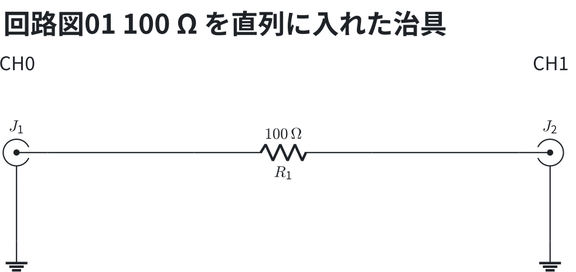
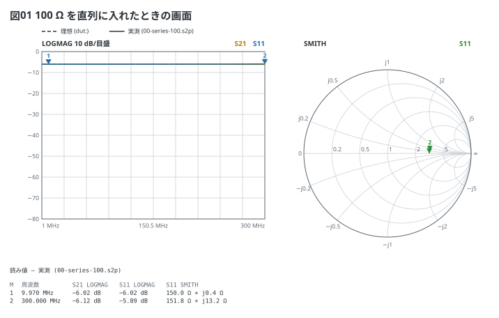
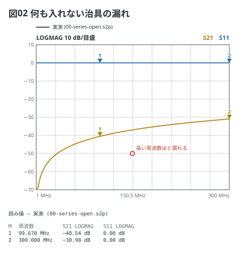

# 直列治具の画面 — 理想と実測

部品 1 つを NanoVNA の CH0 と CH1 の間に直列に入れる治具 (教科書の 3-1)。
`dut:` に**理想の模型**を書くと、測る前から「見るべき値」が破線で出る。
`data:` に**測った Touchstone** を書くと、同じ色の実線で重なる。

DUT の等価回路 — CH0 (J1) と CH1 (J2) の間に 100 Ω が 1 本入るだけ。

```circuit
title: 回路図01 100 Ω を直列に入れた治具
parts:
  J1: sma b2 mirror
  R1: resistor b4 b6 100
  J2: sma b8
  G1: ground c2
  G2: ground c8
wires:
  - J1.1 -- b4
  - b6 -- J2.1
  - J1.2 -- c2
  - J2.2 -- c8
notes:
  - text a2 center: CH0
  - text a8 center: CH1
```



```vna
device: h4
sweep: 1M-300M 101
title: 図01 100 Ω を直列に入れたときの画面
dut: series R 100
data: 00-series-100.s2p
traces:
  - S21 logmag
  - S11 logmag
  - S11 smith
markers:
  - 10M
  - 300M
```



読み方:

- 50 Ω 系に直列に Z を入れると S21 = 2·50 / (2·50 + Z)、S11 = Z / (2·50 + Z)。
  100 Ω なら**どちらも −6.02 dB**、Smith は実軸の r = 3 (150 Ω) の 1 点
- 実線 (実測) は 300 MHz に近づくと理想から離れる。リードのインダクタンスと
  足の間の容量のせいで、**そこが治具と部品の限界** (教科書の 3-6)
- 図の下の読み値は**実測の値** (マーカーは一番近い点に吸い付く、実機と同じ)。
  `data:` が無ければ模型をその周波数で計算した値
- `00-series-100.s2p` は**計算で作った例のデータ** (実測ではない。
  `scripts/fakeData.mjs` が書く)

何も入れない (開放) ときは、SMA どうしの漏れが見える。S21 は小さいほど良い。

```vna
sweep: 1M-300M 101
title: 図02 何も入れない治具の漏れ
data: 00-series-open.s2p
traces:
  - S21 logmag
  - S11 logmag
markers:
  - 100M
  - 300M
notes:
  - text 150M -50dB: 高い周波数ほど漏れる
```


