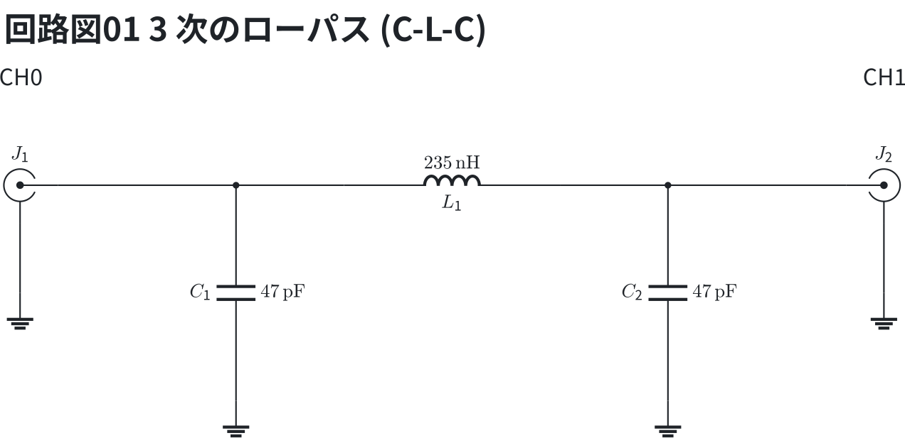
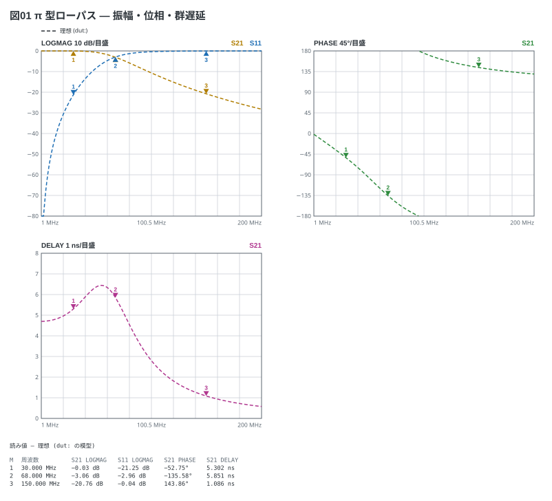
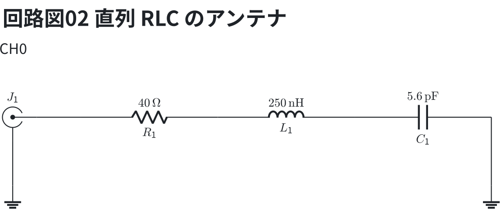
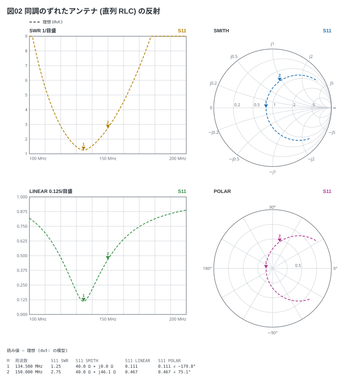

# トレースの形式

`traces:` には NanoVNA のメニューと同じ名前を書く (4 本まで)。**同じ単位の
トレースは 1 つの枠に重なり**、Smith・極・TDR はそれぞれの枠になる。
色は書いた順 (実機の 1〜4 本目と同じ黄・水色・緑・紫)。

DUT の等価回路 — `dut:` の 3 行を CH0 (J1) から CH1 (J2) へ並べたもの。
`shunt` は地へ落とす枝、`series` は信号の通り道に入る。

```circuit
title: 回路図01 3 次のローパス (C-L-C)
parts:
  J1: sma b2 mirror
  C1: capacitor b4 d4 47p
  L1: inductor b5 b7 235n
  C2: capacitor b8 d8 47p
  J2: sma b10
  G1: ground c2
  G2: ground d4
  G3: ground d8
  G4: ground c10
wires:
  - J1.1 -- b4 -- b5
  - b7 -- b8 -- J2.1
  - J1.2 -- c2
  - J2.2 -- c10
notes:
  - text a2 center: CH0
  - text a10 center: CH1
```



```vna
sweep: 1M-200M 201
title: 図01 π 型ローパス — 振幅・位相・群遅延
dut:
  - shunt C 47p
  - series L 235n
  - shunt C 47p
traces:
  - S21 logmag
  - S11 logmag
  - S21 phase
  - S21 delay
markers:
  - 30M
  - 68M
  - 150M
```



- 47 pF / 235 nH / 47 pF は 50 Ω 系のバターワース (遮断 68 MHz)。マーカー 2 で
  S21 が −3 dB
- 位相は ±180° で折り返す (線は繋がない)。群遅延は位相の傾き

反射の見方 (S11) — SWR・|S|・極・Smith。

DUT の等価回路 — R・L・C を直列に並べ、最後の `short` で地へ落とす。CH1 には繋がない。

```circuit
title: 回路図02 直列 RLC のアンテナ
parts:
  J1: sma b2 mirror
  R1: resistor b3 b5 40
  L1: inductor b5 b7 250n
  C1: capacitor b7 b9 5.6p
  G1: ground c2
  G2: ground c9
wires:
  - J1.1 -- b3
  - b9 -- c9
  - J1.2 -- c2
notes:
  - text a2 center: CH0
```



```vna
sweep: 100M-200M 201
title: 図02 同調のずれたアンテナ (直列 RLC) の反射
dut:
  - series R 40
  - series L 250n
  - series C 5.6p
  - short
traces:
  - S11 swr
  - S11 smith
  - S11 linear
  - S11 polar
markers:
  - 134.5M
  - 150M
```



- 最後の `short` は「その先を短絡する」。**CH1 に繋がない 1 端子**になり、S11 は
  部品そのもののインピーダンスになる (S21 は描かない)
- 共振 (134.5 MHz) で SWR が最小。Smith では実軸を横切る所

| 形式 | 見るもの | 描ける S |
| --- | --- | --- |
| `logmag` | 振幅 (dB) | S11 / S21 |
| `phase` | 位相 (度) | S11 / S21 |
| `delay` | 群遅延 (ns) | S11 / S21 |
| `linear` | 振幅 (\|S\|) | S11 / S21 |
| `polar` | 極 | S11 / S21 |
| `smith` | Smith チャート | S11 |
| `swr` | SWR | S11 |
| `r` `x` `z` | インピーダンスの実部・虚部・大きさ (Ω) | S11 |
| `tdr` | 時間領域 (距離) | S11 |
