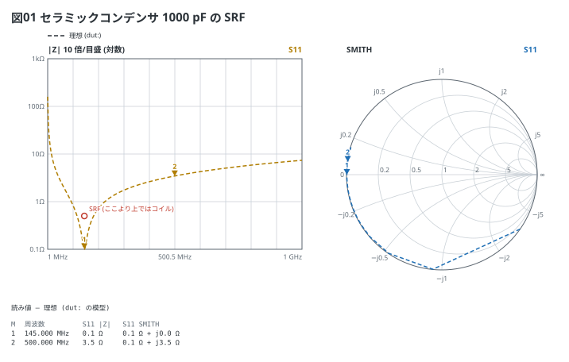
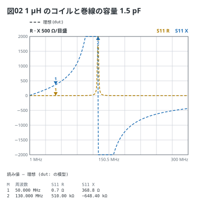
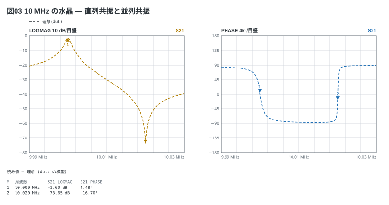

# 部品の周波数特性 — 寄生分のある模型

部品は理想の値のほかに**寄生分**を持てる。`esr` と `esl` は直列に、`cp` は全体に
並列に付く。**1 端子にして (最後に `short`) |Z| を見る**と、自己共振 (SRF) が谷になる。

```vna
sweep: 1M-1G 401
title: 図01 セラミックコンデンサ 1000 pF の SRF
dut:
  - series C 1000p esr 0.1 esl 1.2n
  - short
traces:
  - S11 z
  - S11 smith
markers:
  - 145M
  - 500M
notes:
  - text 145M 0.5Ω: SRF (ここより上ではコイル)
```



- 1 / (2π √(1.2 nH × 1000 pF)) = 145 MHz で |Z| が ESR (0.1 Ω) まで落ちる
- |Z| だけの枠は**対数** (10 倍ごと)。R や X を混ぜると線形になる

コイルの**並列**の共振 (巻線の間の容量 `cp`) は山になる。R と X を重ねる。

```vna
sweep: 1M-300M 301
title: 図02 1 µH のコイルと巻線の容量 1.5 pF
dut:
  - series L 1u esr 0.5 cp 1.5p
  - short
traces:
  - S11 r
  - S11 x
markers:
  - 50M
  - 130M
```



水晶は C (小さい) + L (大きい) + R に並列の C (電極)。`esl` と `cp` で書ける。

```vna
sweep: 9.99M-10.03M 401
title: 図03 10 MHz の水晶 — 直列共振と並列共振
dut:
  - series C 20f esl 12.665m esr 20 cp 5p
traces:
  - S21 logmag
  - S21 phase
markers:
  - 10M
  - 10.02M
```


