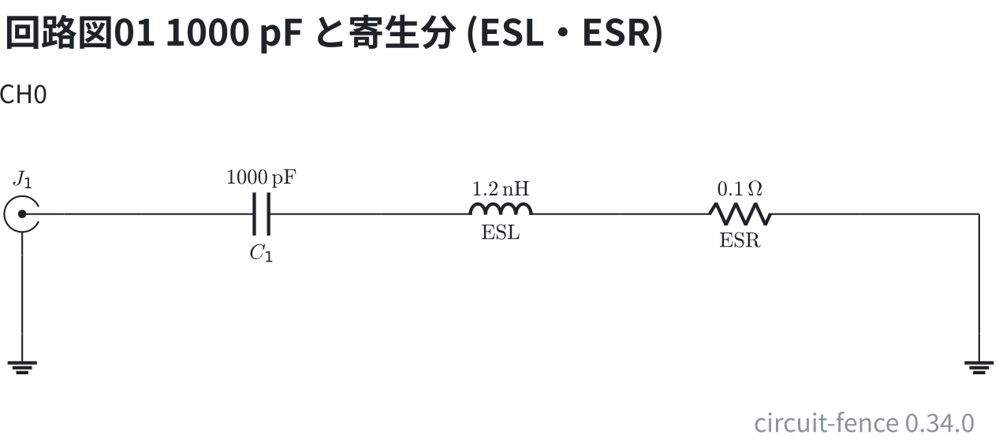
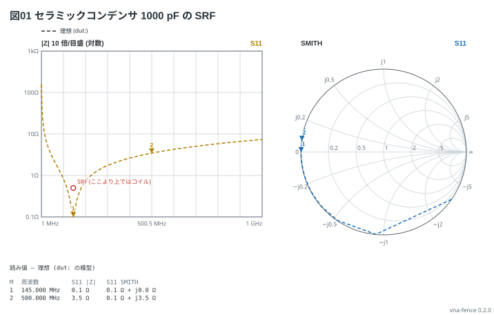
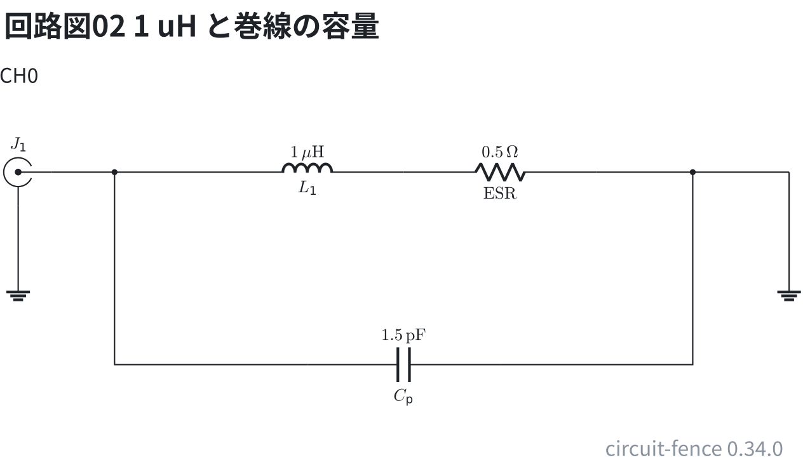
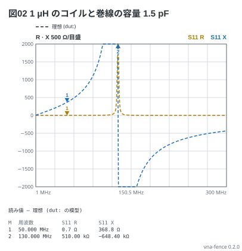
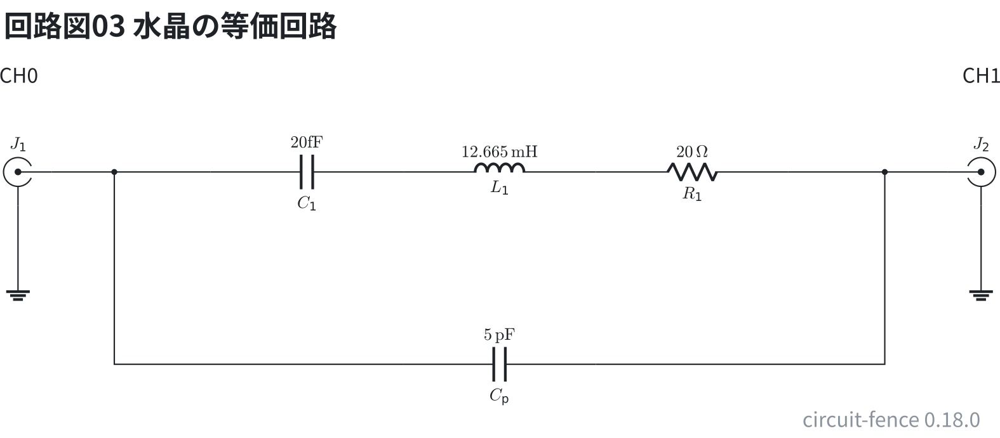
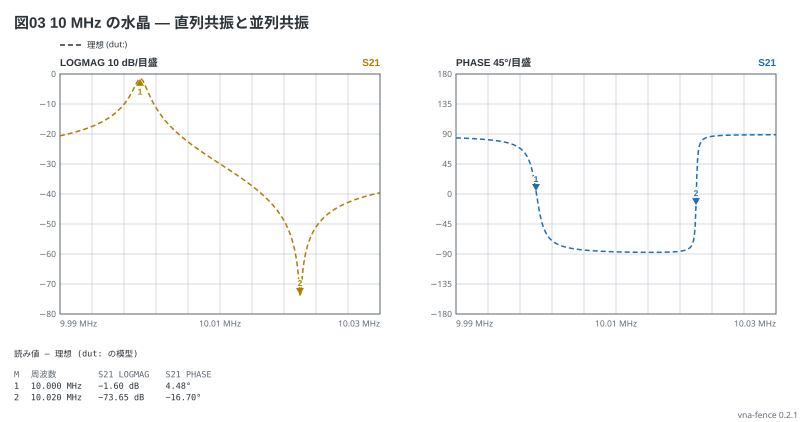

# 部品の周波数特性 — 寄生分のある模型

部品は理想の値のほかに**寄生分**を持てる。`esr` と `esl` は直列に、`cp` は全体に
並列に付く。**1 端子にして (最後に `short`) |Z| を見る**と、自己共振 (SRF) が谷になる。

DUT の等価回路 — `series C 1000p esr 0.1 esl 1.2n` を開いたもの。ESL と ESR は C に直列に付き、最後の `short` で地へ落とす。

```circuit
title: 回路図01 1000 pF と寄生分 (ESL・ESR)
parts:
  J1: sma 2,2 mirror
  C1: capacitor 3,2 5,2 1000p
  LS: inductor 5,2 7,2 1.2n l=$\mathrm{ESL}$
  RS: resistor 7,2 9,2 0.1 l=$\mathrm{ESR}$
  G1: ground 2,3
  G2: ground 10,3
wires:
  - J1.1 -- 3,2
  - 9,2 -- 10,2 -- 10,3
  - J1.2 -- 2,3
notes:
  - text 2,1 center: CH0
```



```vna
sweep: 1M-1G 401
title: 図01 セラミックコンデンサ 1000 pF の SRF
dut:
  - series C 1000p esr 0.1 esl 1.2n
  - short
traces:
  - S11 z
  - S11 smith
markers:
  - 145M
  - 500M
notes:
  - text 145M 0.5Ω: SRF (ここより上ではコイル)
```



- 1 / (2π √(1.2 nH × 1000 pF)) = 145 MHz で |Z| が ESR (0.1 Ω) まで落ちる
- |Z| だけの枠は**対数** (10 倍ごと)。R や X を混ぜると線形になる

コイルの**並列**の共振 (巻線の間の容量 `cp`) は山になる。R と X を重ねる。
山は細い (Q が高い) ので、共振のまわり (129〜131 MHz) だけを掃引する —
1〜300 MHz で掃引すると山が 1 本の針になり、`check` が狭い掃引を勧める。

DUT の等価回路 — `cp` は L と ESR を合わせた全体に並列に付く。

```circuit
title: 回路図02 1 uH と巻線の容量
parts:
  J1: sma 2,2 mirror
  L1: inductor 4,2 6,2 1u
  RS: resistor 6,2 8,2 0.5 l=$\mathrm{ESR}$
  CP: capacitor 5,4 7,4 1.5p l=$C_\mathrm{p}$
  G1: ground 2,3
  G2: ground 10,3
wires:
  - J1.1 -- 3,2 -- 4,2
  - 8,2 -- 9,2 -- 10,2
  - 3,2 |- 5,4
  - 7,4 -| 9,2
  - 10,2 -- 10,3
  - J1.2 -- 2,3
notes:
  - text 2,1 center: CH0
```



```vna
sweep: 129M-131M 301
title: 図02 1 µH のコイルと巻線の容量 1.5 pF
dut:
  - series L 1u esr 0.5 cp 1.5p
  - short
traces:
  - S11 r
  - S11 x
markers:
  - 129.5M
  - 130M
```



水晶は C (小さい) + L (大きい) + R に並列の C (電極)。`esl` と `cp` で書ける。

DUT の等価回路 — `series C 20f esl 12.665m esr 20 cp 5p` を開いたもの。直列の C・L・R に電極の容量 Cp が並列に付き、CH0 と CH1 の間に入る。

```circuit
title: 回路図03 水晶の等価回路
parts:
  J1: sma 2,2 mirror
  C1: capacitor 4,2 6,2 20fF
  L1: inductor 6,2 8,2 12.665m
  R1: resistor 8,2 10,2 20
  CP: capacitor 6,4 8,4 5p l=$C_\mathrm{p}$
  J2: sma 12,2
  G1: ground 2,3
  G2: ground 12,3
wires:
  - J1.1 -- 3,2 -- 4,2
  - 10,2 -- 11,2 -- J2.1
  - 3,2 |- 6,4
  - 8,4 -| 11,2
  - J1.2 -- 2,3
  - J2.2 -- 12,3
notes:
  - text 2,1 center: CH0
  - text 12,1 center: CH1
```



```vna
sweep: 9.99M-10.03M 401
title: 図03 10 MHz の水晶 — 直列共振と並列共振
dut:
  - series C 20f esl 12.665m esr 20 cp 5p
traces:
  - S21 logmag
  - S21 phase
markers:
  - 10M
  - 10.02M
```


