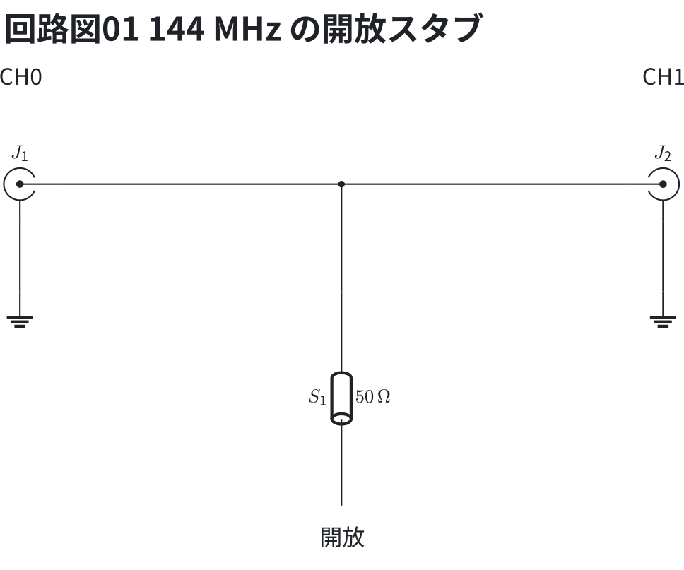
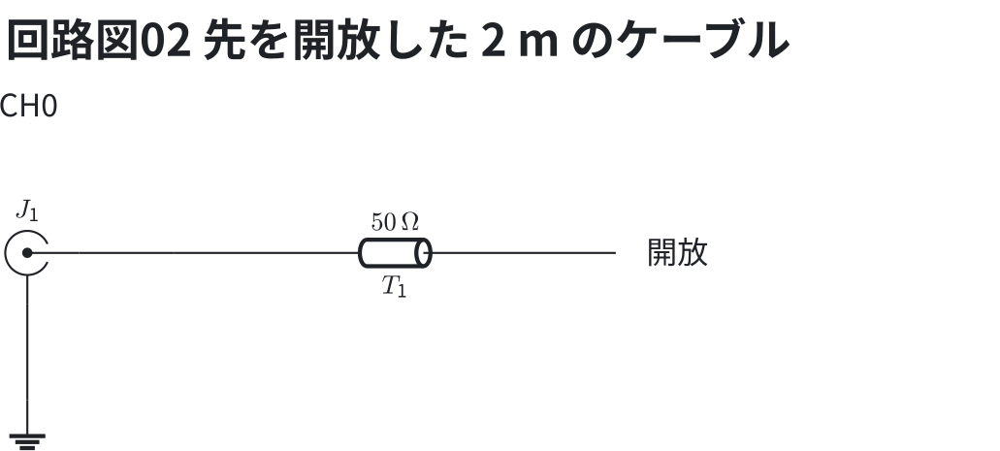

# 伝送線路とスタブ、TDR

`line Z0 長さ vf 速度係数` は損失の無い線路。**縦続の順に書く**。
並列 (`shunt`) の線路はスタブで、先を `open` か `short` にする。

DUT の等価回路 — 線路は伝送線路 (`tline`、値は Z0)。CH0 と CH1 を結ぶ所から 34.4 cm のスタブが分かれ、先は開放。

```circuit
title: 回路図01 144 MHz の開放スタブ
parts:
  J1: sma b2 mirror
  S1: tline c5 e5 50
  J2: sma b8
  G1: ground c2
  G2: ground c8
wires:
  - J1.1 -- b5 -- J2.1
  - b5 -- c5
  - J1.2 -- c2
  - J2.2 -- c8
notes:
  - text a2 center: CH0
  - text a8 center: CH1
  - text e5d0 center: 開放
```



```vna
sweep: 1M-300M 301
title: 図01 144 MHz の λ/4 開放スタブ (ノッチ)
dut:
  - shunt line 50 34.4cm vf 0.66 open
traces:
  - S21 logmag
  - S11 smith
markers:
  - 144M
notes:
  - band 140M 148M: 2m バンド
```


- λ/4 = 0.66 × 299.8 / 144 / 4 = 34.4 cm。開放の先が入口では短絡に見え、
  144 MHz を落とす

ケーブルの先を開放して TDR を見ると、**先端までの距離**に山が立つ。

DUT の等価回路 — 2 m の線路の先を開放したまま。CH1 には繋がない。

```circuit
title: 回路図02 先を開放した 2 m のケーブル
parts:
  J1: sma b2 mirror
  T1: tline b3 b6 50
  G1: ground c2
wires:
  - J1.1 -- b3
  - J1.2 -- c2
notes:
  - text a2 center: CH0
  - text b6a2: 開放
```



```vna
sweep: 1M-900M 401
title: 図02 先を開放した 2 m のケーブル
dut:
  - line 50 2m vf 0.66
  - open
traces:
  - S11 tdr vf 0.66
  - S11 logmag
  - S11 phase
markers:
  - 100M
```


- TDR は**帯域通過のインパルス応答**。山の位置が反射の場所で、開放か短絡かの
  見分けは出ない (低域通過のステップは持たない)
- 横に見える範囲は 1 / (点の間隔) で決まる (図の下の 1 行)。**TDR には等間隔の
  掃引が要る**
