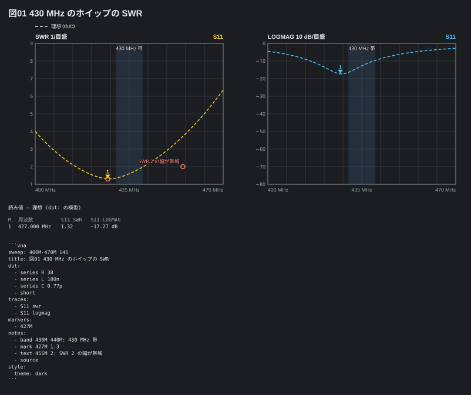
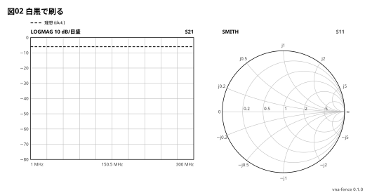

# 注釈と見た目

注釈の番地は**周波数と値**。値の単位で置く枠が決まる (`-20dB` は dB の枠、
`45deg` は位相、`1.2ns` は群遅延、`50Ω` は R・X・|Z|、単位の無い数は SWR か linear)。

```vna
sweep: 400M-470M 141
title: 図01 430 MHz のホイップの SWR
dut:
  - series R 38
  - series L 180n
  - series C 0.77p
  - short
traces:
  - S11 swr
  - S11 logmag
markers:
  - 427M
notes:
  - band 430M 440M: 430 MHz 帯
  - mark 427M 1.3
  - text 455M 2: SWR 2 の幅が帯域
  - source
style:
  theme: dark
```



| 注釈 | 書き方 |
| --- | --- |
| 丸 | `- mark 100M -6dB` |
| 字 | `- text 100M -20dB: 字` |
| 帯 | `- band 88M 108M` / `- band 88M 108M: 字` |
| 書き出し | `- source` (フェンスの中身を図の下に) |

見た目は `style:` — テーマ (`light` `dark` `mono`)、幅 (`width`)、版の刻印
(`stamp`)、お知らせを帯に出すか (`debug`)。白黒で刷るなら `mono`。

```vna
sweep: 1M-300M
title: 図02 白黒で刷る
dut: series R 100
traces:
  - S21 logmag
  - S11 smith
style:
  theme: mono
  width: 520
  stamp: on
```


