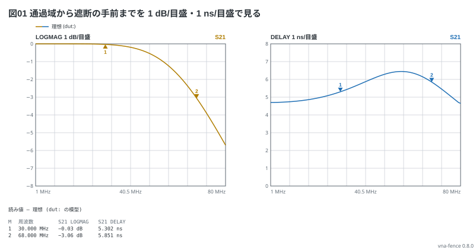
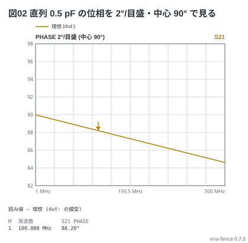

# 縦の尺度

`traces:` の 1 行の末尾に**1 目盛あたりの量**を書くと、その枠の縦の尺度を変えられる
(実機の SCALE と同じ)。動きの小さい特性を平らな線にしないための書き方。

```vna
sweep: 1M-80M 100
title: 図01 通過域から遮断の手前までを 1 dB/目盛・1 ns/目盛で見る
dut:
  - shunt C 47p
  - series L 235n
  - shunt C 47p
traces:
  - S21 logmag 1dB
  - S21 delay 1ns
markers:
  - 30M
  - 68M
```



- 書かなければ LOGMAG は 10 dB/目盛。そのままだと 0〜−5 dB の落ち込みは 1 目盛の半分で、肩の形が読めない
- LOGMAG は上が 0 dB のまま、1 目盛の量だけ変わる (0 dB から 8 目盛下がる)。DELAY は 0 が下端
- 尺度を書いた枠には「動きが 1 目盛に満たない」お知らせは出ない。値が 8 目盛の外に出るときは、収まる尺度を添えてお知らせが出る

## 位相の中心

位相は既定で 0° が中央。直列のコンデンサのように +90° 付近にあって数度しか動かない特性は、
尺度の後ろに `at` と中心の角度を書いて、見たい値を画面の中央に置く (実機の REFERENCE POSITION)。

```vna
sweep: 1M-300M 101
title: 図02 直列 0.5 pF の位相を 2°/目盛・中心 90° で見る
dut: series C 0.5p
traces:
  - S21 phase 2deg at 90deg
markers:
  - 100M
```



- `S21 phase 2deg at 90deg` は中央が 90°で、上下 4 目盛なので 82°〜98°。縦軸の字は実際の値で出る
- 中心は −180°〜180°。中心の上下 4 目盛が ±180° をまたぐときは、反対側に折り返して描き、お知らせが出る
- `at` は phase の尺度の後ろだけに書ける
